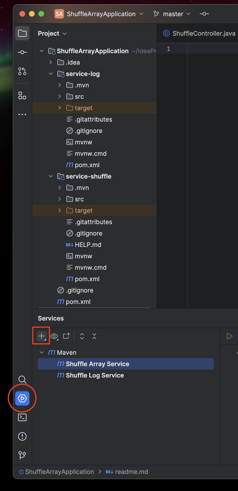
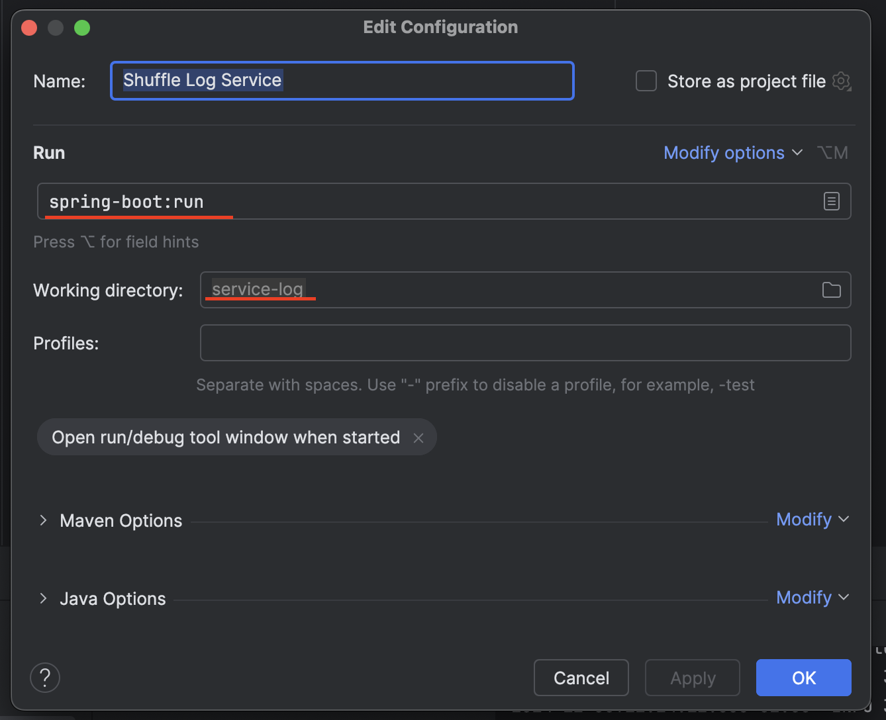
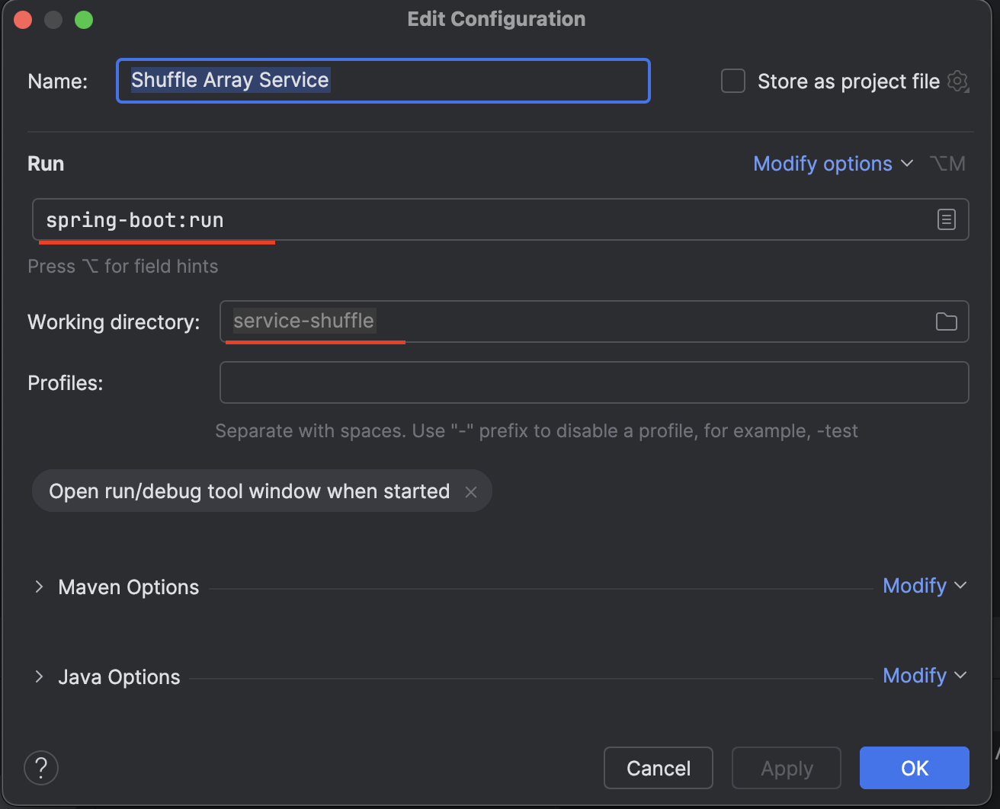
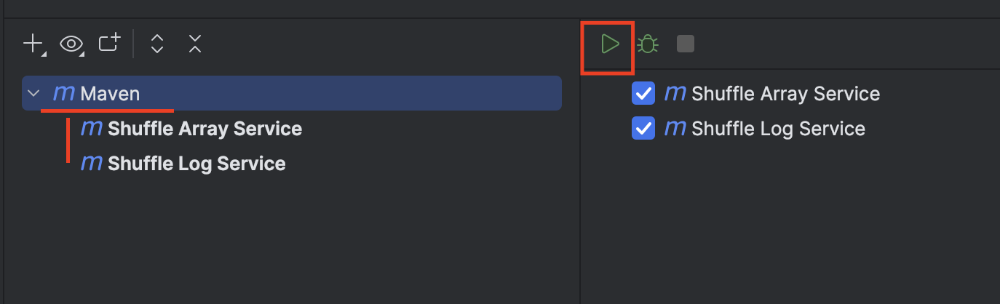
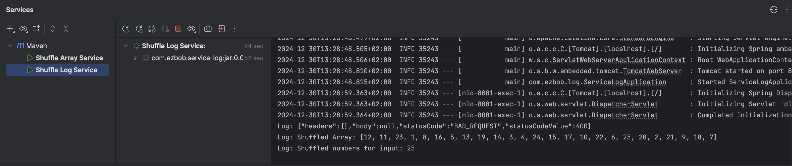

# Shuffle Array Application

This project generates a shuffled list of numbers based on a given input and provides a simple API for interacting with
the system. It is built using Spring Boot and consists of multiple services such as shuffle service and logging service.

## Prerequisites

Before you begin, ensure you have the following installed on your system:

- [Spring Boot](https://spring.io/quickstart)
- [Java 11 or later](https://adoptopenjdk.net/)
- [Maven](https://maven.apache.org/) (for managing project dependencies)

## Cloning the Repository

To clone the repository, follow these steps:

1. Open your terminal (or Git Bash on Windows).
2. Run the following command:
   ```bash
   git clone https://github.com/bigsleep09/Ezbob-Shuffle-Array-Microservice.git
   ```
3. Open the Repository into your IDE

## Run Setup

### Add Service

Go to **Services** located at the bottom section from the Tools sidebar, and click the **+** sign


### Configure the run for each service

1. Select one of the services modules (```service-log or service-shuffle```) in the **Working Directory** dropdown
2. In the **Run** dropdown, type and select ```spring-boot:run```
   
   

### Run both services

1. Select the Maven runner, and click the **PLAY** button
   

### Extra steps

- Once both services are up and running, use **POSTMAN** and run the following cURL

```bash
   curl --location --request POST 'http://localhost:8080/api/shuffle?number=1030'
   ```

>***NOTE: In case that the number is not in range 1 to 1000 a BAD REQUEST response will be received. Feel free to change
it***

- After the request has been sent, return to your IDE, select the shuffle log service console and look at the message
